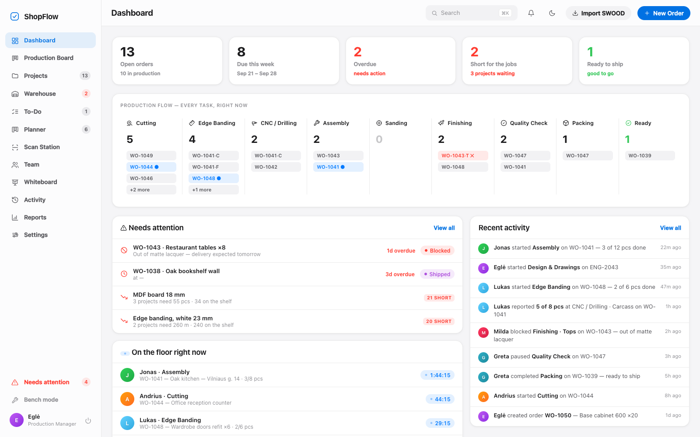
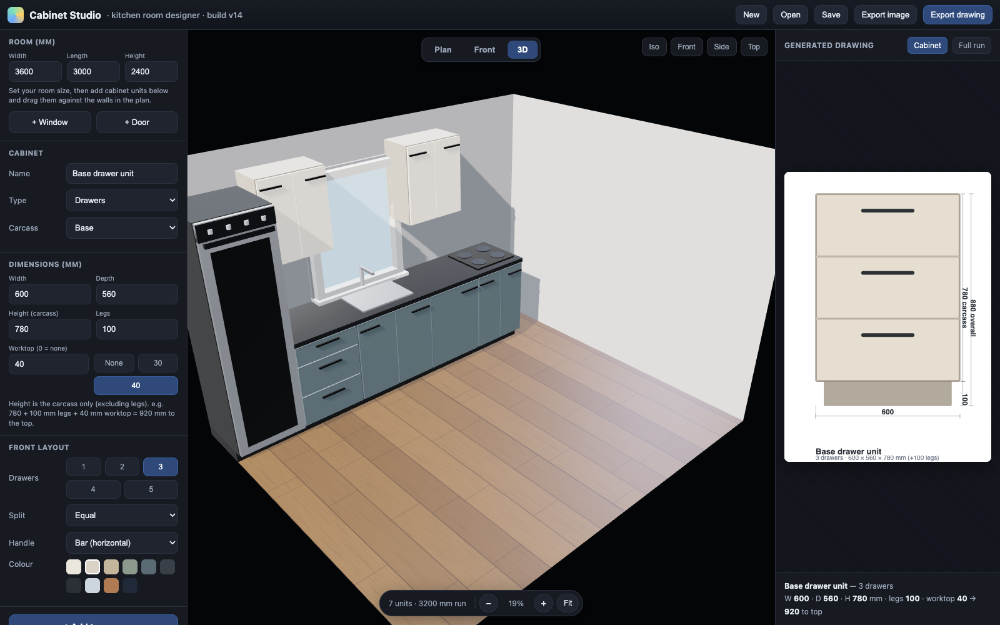
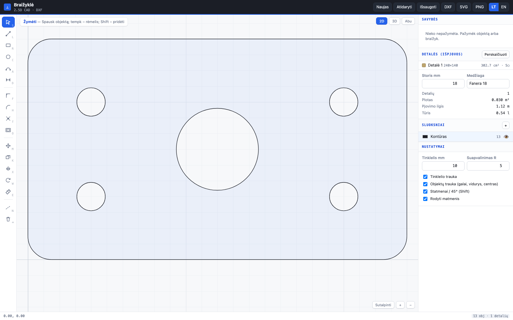
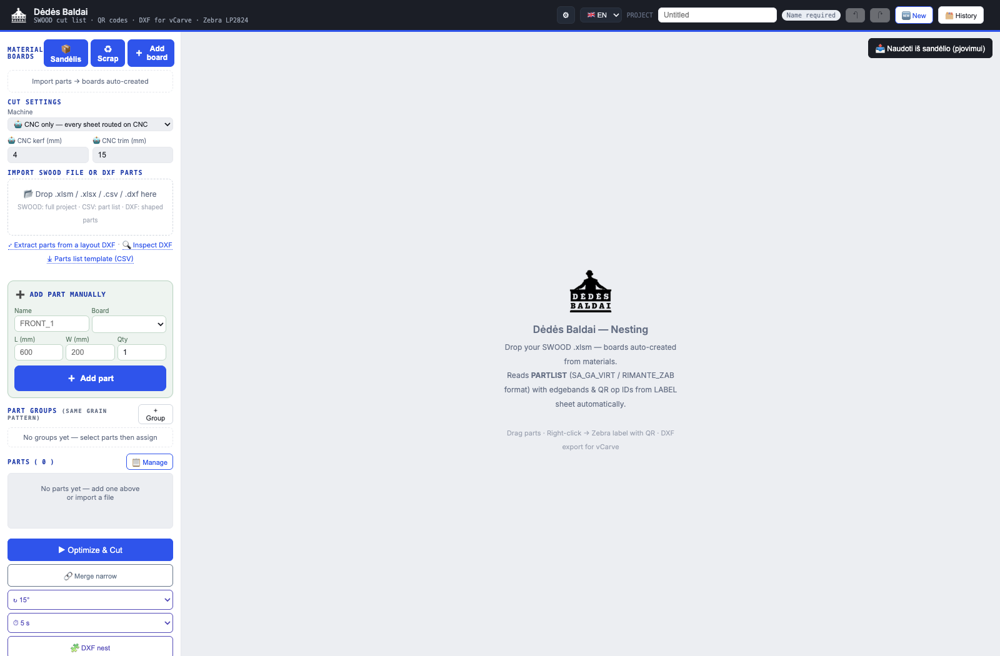
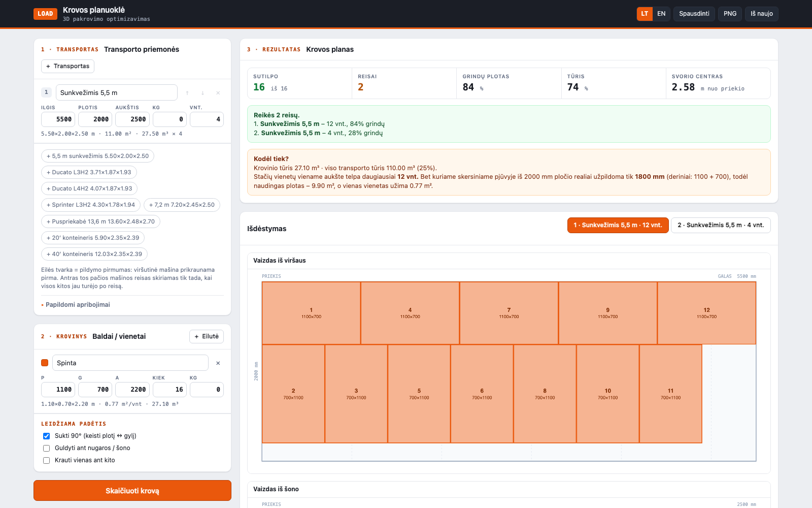
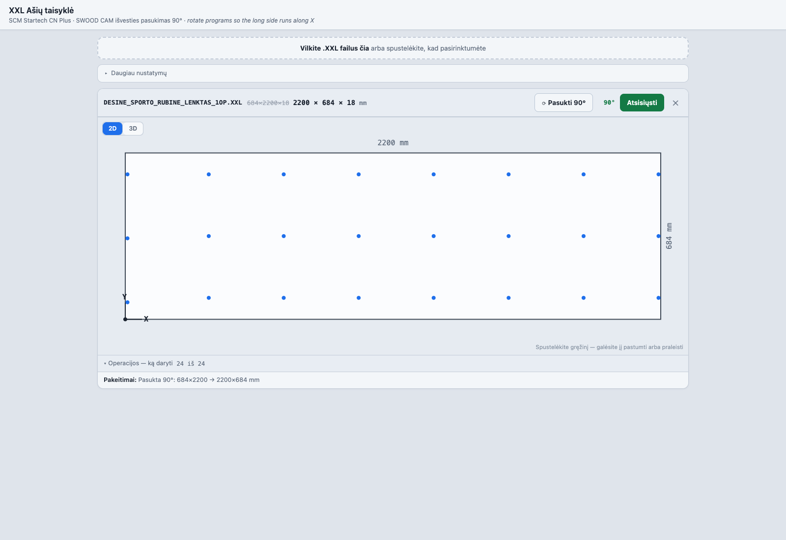

# I build operational tools that solve everyday problems

I work in furniture manufacturing in Lithuania, and I write the software the workshop runs on.

Every project here started the same way: something on the shop floor was slow, manual or
expensive, no off-the-shelf tool fit the way we actually work, and the commercial options were
either priced per seat per month or licensed "non-commercial use only". So I built the tool.

These aren't tutorials or clones. They are in daily use by people who are not developers, on
tablets in a workshop, often with no reliable internet — which is why almost all of them run
offline, in a browser, with no install and no build step.

---

## Featured work

### ShopFlow — production management for a furniture workshop
*The MRP system we couldn't buy: orders, parallel routing lanes, live shop-floor status.*

Work orders break into article lines; each line's operations form **parallel lanes** (facades,
carcass) that merge into a shared final lane, and pieces flow downstream as they finish. Workers
sign in with a PIN on a shared tablet and see only their own station. Managers get the cockpit:
what's overdue, what's short, who's on the floor right now.

~31,000 lines, **1,057 in-browser tests**, offline-first PWA with optional cloud sync.

*Source is currently private while I scrub workshop data out of its history — happy to walk
through the code on request.*

---

### Cabinet Studio — kitchen designer that outputs shop drawings
*Design the room in 3D, get the dimensioned cabinet drawing out the other end.*

Drag units into a room plan, switch to a PBR-rendered 3D view, and the panel on the right
generates the technical drawing for the selected cabinet — carcass height, legs, worktop, the
920 mm to the top — the numbers the workshop actually needs.

Built on three.js in a single HTML file. &nbsp;→ **[Repo](https://github.com/gervdalius-droid/cabinet-studio)**

---

### Braižyklė — a 2.5D CAD I wrote because the free ones are licensed "non-commercial"
*Draw an outline, give it a thickness, export DXF to the router.*

Real CAD behaviour: snapping to ends/midpoints/centres/intersections, typed numeric entry
(length, Tab for angle, Enter to place), fillet, chamfer, trim against true intersections,
offset with sharp corners, arrays and mirroring. Closed loops are detected automatically,
inner loops become holes, and **open ends are flagged in red** — because CAM will reject them.

Exports DXF R12 with a layer table, and deliberately leaves construction lines and dimensions
out so the CAM software never mistakes them for geometry.

~1,800 lines, 72 checks. &nbsp;→ **[Repo](https://github.com/gervdalius-droid/cad)**

---

### Nesting — cutting optimisation with a true-shape engine
*Less offcut per sheet is money, every single sheet.*

Imports a SWOOD project (`.xlsm`), a CSV part list or shaped parts from DXF, then nests them —
rectangular strip packing for panels, and a Rust/WASM true-shape engine
([jagua-rs](https://github.com/JeroenGar/jagua-rs)) compiled with `wasm-bindgen-rayon` for
irregular parts. Outputs a cut list, Zebra labels with QR codes, and DXF for vCarve.

~17,000 lines. &nbsp;→ **[Repo](https://github.com/gervdalius-droid/nesting)** · [Live](https://gervdalius-droid.github.io/nesting/)

---

### Krovos planuoklė — 3D load planner
*How many units fit in the van, where each one goes, and how many trips it takes.*

Two independent solvers run and the better result wins: a band packer that splits the body into
strips (strong on uniform loads) and a randomised extreme-point packer. Constraints are the ones
that actually bite — what the crew can physically lift, what a 100 kg cabinet can have stacked on
it, lifting height, payload.

It also explains itself: *"2000 mm of width only really fills to 1800 (1100 + 700), so usable
floor is 9.90 m²"* — so the planner can argue with it instead of trusting it.

41 checks. &nbsp;→ **[Repo](https://github.com/gervdalius-droid/truckload)**

---

### XXL Ašių taisyklė — a 90° rotation that saves a daily manual fix
*The smallest tool here, and the clearest example of how I pick problems.*

SWOOD CAM exports a part in the orientation it has in the model, not the one the machine accepts.
On our SCM Startech CN Plus the Y axis is the short one — so a 684 × 2200 part has to be turned
by hand, every time.

I analysed **1,284 real machine programs** to prove it rather than assume it: max `DX` used was
2746 mm, max `DY` was 1015 mm, and not one program had `DY > 1300`. So the rule is safe to
automate. Drop the file in, it rotates, you download it.

66 checks. &nbsp;→ **[Repo](https://github.com/gervdalius-droid/xxl-fix)**

---

### Sąskaitos faktūros — Lithuanian invoicing, fully offline
*VAT invoices, waybills, and a buyer picker over the whole company register.*

Pick the buyer and the rest fills itself in — because the app ships an **offline index of ~233,000
registered Lithuanian companies** built from Registrų centras and VMI open data. The registry has
no CORS headers, so the data is pre-built into a compressed blob and searched locally; folded and
raw text are kept byte-for-byte aligned so search offsets stay valid.

Also exports UBL e-invoices. 28 checks. &nbsp;→ **[Repo](https://github.com/gervdalius-droid/invoices)** · [Live](https://gervdalius-droid.github.io/invoices/)

---

### Hub — one system out of several apps
*Quote → order → invoice, sharing one customer.*

The shop's tools grew separately, so the hub mounts them on a single origin and gives them a
shared customer record and a document index that links a quote to the order it became and the
invoice it ended as. &nbsp;→ **[Repo](https://github.com/gervdalius-droid/hub)** · [Live](https://gervdalius-droid.github.io/hub/)

---

## How I build

**Browser-first, no build step.** Most of these are one HTML file plus a few scripts. No bundler,
no `node_modules`, no deploy pipeline to break. A workshop tablet opens a URL and it works.

**Offline-first.** The shop's internet is not reliable and a saw doesn't stop for it. State lives
in `localStorage`/IndexedDB; cloud sync is optional and additive, never required.

**Tests that run where the app runs.** Every project ships a `test.html` you open in a browser —
1,057 checks in ShopFlow, 72 in the CAD, 66 in the XXL fixer. No runner to install.

**Decisions backed by the shop's own data.** The XXL rotation rule came out of 1,284 real
programs. The load planner explains its own packing so a human can overrule it.

**Built for people who aren't developers.** PIN login on a shared tablet, Lithuanian UI with an
EN toggle, and an interface that shows the one number someone needs rather than everything.

---

## Tech

Vanilla JavaScript · HTML Canvas · three.js · WebAssembly (Rust, via wasm-bindgen-rayon) ·
Web Workers · Service Workers / PWA · IndexedDB · Supabase (Postgres, Auth, RLS) · Python
(tooling, CDP test harnesses) · DXF / UBL / CNC post-processing

**Domain:** furniture manufacturing, CAD/CAM, CNC, nesting and cut optimisation, MRP and
production routing, Lithuanian invoicing and VAT.

📫 gervdalius@gmail.com
